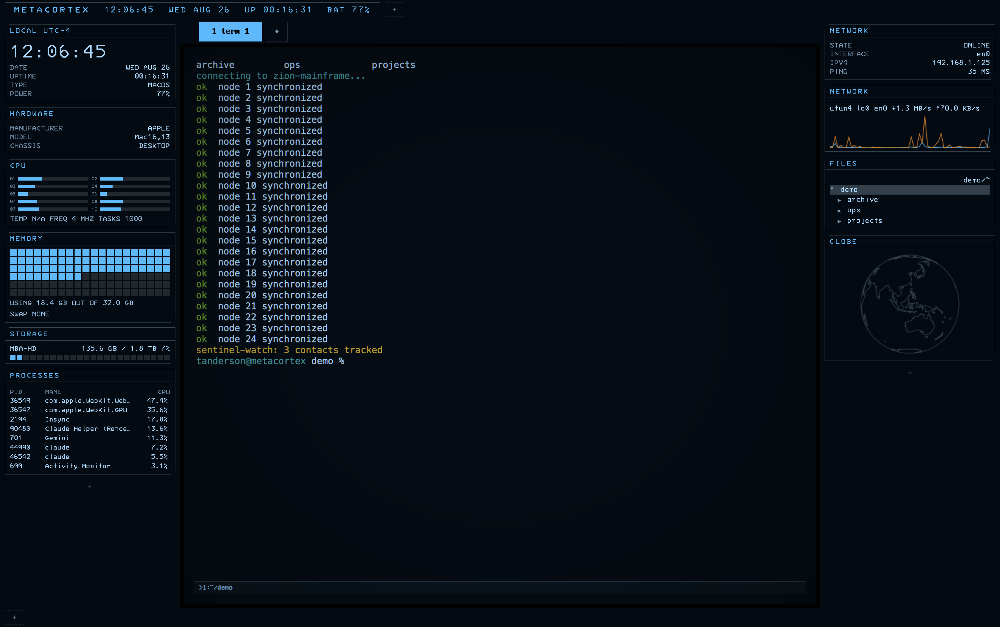
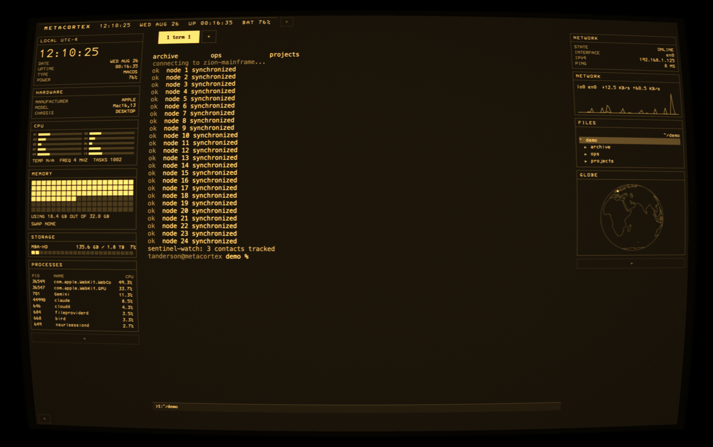

# Phosphor

A terminal with either a Retro CRT or Next-Gen look wrapped in a system cockpit, built for living in AI command-line sessions all day. One terminal, two personalities: a glowing amber tube from 1982, or a flat Tron-style dashboard from 20 years in the future.

 


*NextGen mode, Tron scheme, cockpit on*


*Retro CRT mode, amber scheme. The faint trail in the process panel is phosphor persistence doing its job on a list that never sits still.*

## Why Phosphor exists

I created Phosphor because I find myself caught between a deep appreciation for retro aesthetics and a fascination with technology that feels like it's 20 years in the future. That curiosity naturally led me to projects like cool-retro-term and eDEX-UI.

I'm not a developer by trade. I spent 15 years away from needing a terminal to manage Linux systems and Cisco switches, and came back to the command line because of AI. What I wanted was a daily driver that simply made me smile every time I opened it, and perhaps made anyone who saw me using it think I must either work for the NSA or be hacking the Pentagon. Both of those older projects needed an update and weren't being actively maintained. So rather than run two separate apps with the functional features I wanted, I built a terminal that could be skinned two radically different ways: one retro, the other next-gen. After creating something basic, I just kind of kept going. I run my AI agents from here, along with some always-on apps.

I'm sure anyone who is a hardcore developer will find it lacking. But if you are one, and you wish it could do something else, please let me know. I tend to run fixes and updates on Friday and Saturday, burning down whatever AI tokens I have left over from the week.

## What it is

Under the glow, Phosphor is a real terminal: a Rust backend runs your actual shell, and the display is drawn through WebGL shaders that mimic a phosphor monitor, curvature, scanlines, glow, and all. Around the terminal, an optional "cockpit" wraps the screen in live dashboard widgets: clocks, CPU and memory meters, a spinning globe of your network connections, file browser, timers, and more. In retro mode the entire cockpit renders through the same CRT glass, so everything bends and glows together.

## Getting started

**macOS:** download the `.dmg` from Releases, open it, and drag Phosphor to Applications.

**Linux (Fedora, Debian, and friends):** grab the `.rpm`, `.deb`, or AppImage from Releases. On Fedora: `sudo dnf install ./phosphor-*.rpm` (dependencies install automatically).

**Build from source:**

```
npm install
npm run tauri dev      # development app with hot reload
npm test               # unit tests
npm run tauri build    # release .app + .dmg (macOS)
```

## The two looks

Two settings control the appearance, and they're independent:

| Setting | Options | What it decides |
|---|---|---|
| RENDER MODE | RETRO CRT or NEXTGEN | Whether the CRT effects are on. Retro gives you the full tube: curvature, scanlines, glow, flicker, all adjustable. NextGen turns every effect off for a clean, flat, modern look. |
| COLOR SCHEME | GREEN, AMBER, MODERN, TRON, DRACULA, NORD, GRUVBOX, SOLARIZED, CATPPUCCIN, GOTHAM | The colors. Green and amber tint everything monochrome like a real single-color tube; the others carry full color palettes. |

Any combination works: a flat modern terminal in Dracula is as valid as a heavily curved green CRT. Switching schemes fires a "degauss," a brief magnetic wobble with color separation, like re-magnetizing a real tube. Three retro fonts are bundled (IBM 3270, IBM VGA, Apple II) with an adjustable size.

## Everyday features

The things you use constantly, in plain terms:

- **Spaces** are tabs. Make them with Cmd+T, switch with Cmd+1 through 9, rename or close them with a right-click, drag them to reorder.
- **Split panes**: divide any space into side-by-side or stacked terminals (Cmd+D and Cmd+Shift+D). Cmd+W closes the current pane, then the space, then the window, in that order. **Cmd+Shift+W undoes it**: the pane comes back with its scrollback restored (inert, read-only) and its startup command sitting unsubmitted at the prompt. Up to 5 deep.
- **Multiple windows**, each with its own look and its own layout.
- **The command palette** (Cmd+P) is the do-anything box: start typing and it filters every space, saved preset, color scheme, saved configuration, and action. Arrow keys and Enter to run.
- **Presets** are launchers. Save a pane's folder and startup command, or save your entire set of open spaces as one preset, and reopen everything with two keys later (Cmd+Shift+T).
- **Configurations** are looks. Save your current combination of widgets, scheme, effects, and font under a name, and switch between them from the palette. New windows can open in any saved look.
- **Everything persists.** Your spaces, splits, folders, and startup commands are saved automatically and restored when you relaunch.
- **Find in scrollback** (Cmd+F) highlights matches as you type. **Cmd+K** clears the screen. **Cmd+click** any link in output to open it in your browser.
- **Broadcast typing** (Cmd+Shift+B): type in one pane, and it goes to every pane in the space. Handy for driving several AI sessions at once.
- **Files and images drop right in.** Drag a file onto the window, or paste an image or a copied file with Cmd+V, and its path is inserted at the prompt, ready for an AI CLI to read.
- **Session logging**: right-click a pane to record everything it outputs to a file.

## Cockpit mode

Cmd+Shift+M wraps the terminal in a live dashboard. Widgets sit in five zones around the terminal: a strip along the top, columns on the left and right, a tab strip, and a strip along the bottom. In retro mode, the whole cockpit renders through the CRT shader, so widgets curve and glow with the terminal; clicks still land exactly where they should.

### The widgets, all 21

| Widget | What it shows |
|---|---|
| SPACES | The tab strip: click to switch, right-click to rename or close, drag to reorder |
| CLOCK | Big local time with date, uptime, and power state |
| CLOCK MINI | A compact clock; add several, each with its own time zone (type a city, get TOKYO UTC+9) |
| HARDWARE | What machine this is |
| CPU | Per-core usage bars, temperature, and task count |
| MEMORY | How much memory is in use, drawn as a dot-matrix fill |
| STORAGE | A bar per drive showing how full it is; turns orange past 90% |
| TOKENS TODAY | Today's AI spend: cost, tokens in and out, and a 24-hour chart (needs the free `tokscale` tool) |
| TIMER | A countdown; right-click to set it; blinks at zero |
| STOPWATCH | Counts up, with start, stop, and reset |
| COUNTDOWN | Days and hours to a date you set (a birthday, a deadline); the label becomes its title |
| PROCESSES | The top 8 processes using your CPU |
| NETWORK | Whether you're online, on what interface, at what address, and your ping |
| GLOBE | A wireframe globe plotting where your network connections actually go |
| RADAR | A rotating radar sweep; every remote server your machine is talking to gets a blip |
| NETWORK TRAFFIC | Upload and download speed over time |
| FILES | A file browser that follows wherever your shell goes; Enter drops a file's path at your prompt |
| KEYBOARD | An on-screen keyboard you can click to type |
| LOG | A live view of any file as it grows; add one per file you want to watch |
| STATUS | The status bar (time, date, battery, network, and more; configurable) |
| SHORTCUTS | The keyboard shortcut list, always current, as a widget |

Adding, moving, and removing widgets happens in place: every zone ends in a `+` button listing what's available, dragging a widget by its header moves it anywhere, and right-click closes it or opens its settings (time zones, file paths, durations, dates). The layout and every setting survive relaunches.

**Built-in alerts:** if your CPU stays above 85%, memory passes 90%, or a drive passes 90% full, a blinking amber warning appears in the status bar. That one is not optional; if something is on fire, the cockpit says so.

## Every menu, explained

**The menu bar** (macOS) is deliberately minimal: the standard app menu (About, Hide, Quit), Edit (the usual Cut, Copy, Paste, Select All; Paste routes through Phosphor's safe-paste path), and Window (Minimize, Maximize, Fullscreen). There's no File menu on purpose: its default shortcuts would fight the terminal's own.

**The command palette** (Cmd+P) holds everything else. Every entry is typed-to-filter:

| Palette entry | What it does |
|---|---|
| SPACE 1: name | Jump to that space |
| PRESET: OPEN name | Open a saved preset here, or IN NEW WINDOW |
| PRESET: SAVE CURRENT SPACES AS… | Save everything open right now as one reopenable set |
| PRESET: DELETE name | Remove a preset |
| SCHEME: NAME | Switch color scheme instantly |
| CONFIG: LOAD / SAVE AS… / DELETE / RESET | Manage saved looks |
| NEW WINDOW / NEW WINDOW: name | Open another window, same look or a named one |
| NEW SPACE, SPLIT RIGHT, SPLIT DOWN, CLOSE PANE | Layout actions |
| BROADCAST INPUT ON/OFF | Toggle type-to-all-panes |
| FIND IN SCROLLBACK | Open search |
| COCKPIT MODE ON/OFF | Toggle the dashboard |
| CONFIG | Open the settings screen |
| SHORTCUT HELP | Show the key list |
| FULLSCREEN | Toggle fullscreen |

**Right-click a pane** for: paste, split right or down, rename this pane, set or clear a command that runs when the pane starts, save the pane as a preset, close it, toggle broadcast, start or stop logging its output to a file, toggle cockpit mode, open config, and fullscreen.

**Right-click a space tab** to rename or close it.

**The config screen** (Cmd+,) is styled like an old BIOS setup page and driven by the keyboard: arrows to move, left and right to change values, Enter to toggle, Esc to leave. Its four groups: TERMINAL (render mode, color scheme, font, and every CRT effect slider), COCKPIT (which sidebars show, cursor blink, the paste guard, boot animation, sounds, widget text size), STATUS BAR (which segments appear and in what order), and IDENTITY (put your own name or brand text in the status bar). Effects lift while the screen is open, so you see every change live.

## Keys

macOS uses Cmd; Linux and Windows use the terminal-standard Ctrl+Shift layer (plain Ctrl combos still reach the shell). The in-app version of this list is Cmd+/.

| Action | macOS | Linux / Windows |
|---|---|---|
| Newline without submitting | Shift+Enter | Shift+Enter |
| Smart paste (text / image / copied file) | Cmd+V | Ctrl+Shift+V |
| Copy selection | Cmd+C | Ctrl+Shift+C |
| Clear scrollback | Cmd+K | Ctrl+Shift+K |
| Find in scrollback | Cmd+F | Ctrl+Shift+F |
| Global search (all panes and spaces) | Cmd+Shift+F | Ctrl+Shift+G |
| New space | Cmd+T | Ctrl+Shift+T |
| Preset picker | Cmd+Shift+T | Ctrl+Shift+P |
| New window | Cmd+Shift+N | Ctrl+Shift+N |
| Switch space | Cmd+1..9 | Alt+1..9 |
| Split right / split down | Cmd+D / Cmd+Shift+D | Ctrl+Shift+D / Ctrl+Shift+B |
| Close pane, then space, then window | Cmd+W | Ctrl+Shift+W |
| Undo close pane | Cmd+Shift+W | Ctrl+Shift+U |
| Move focus between panes | Cmd+Option+Arrows | Ctrl+Shift+Arrows |
| Broadcast typing to all panes in space | Cmd+Shift+B | Ctrl+Shift+I |
| Command palette | Cmd+P | Ctrl+Shift+Space |
| Toggle cockpit mode | Cmd+Shift+M | Ctrl+Shift+M |
| Fullscreen | Cmd+Ctrl+F | (macOS only) |
| Config screen | Cmd+, | Ctrl+, |
| Shortcut list | Cmd+/ | Ctrl+/ |

## The fine print (paste safety and AI-session details)

These aren't headline features, just care taken where terminals usually aren't careful:

- Pasting multiple lines shows a preview (PASTE or CANCEL) before anything reaches the shell, trailing newlines are stripped, and nothing you paste ever auto-runs. Turn the preview off in config if you'd rather paste straight through.
- Shift+Enter inserts a newline without submitting, using the exact key sequence Claude Code expects.
- zsh gets shell integration automatically (your own `~/.zshrc` still loads first): the FILES widget tracks your current folder instantly, and clicking in the input line moves the caret. Other shells fall back to polling.

## Linux builds

Pushing to main triggers CI, which builds `.rpm` and `.deb` for x86_64 and aarch64 plus an x86_64 AppImage; tagged releases get the packages attached under Releases.

The frontend is pinned to xterm.js 5.5 deliberately: the CRT pipeline captures the canvas renderer's layers as a WebGL texture, and xterm 6 removed the canvas renderer.

## Architecture (for developers)

Rust side: `portable-pty` runs your login shell and streams output over a Tauri channel; commands exist for write, resize, cwd lookup, output logging, smart clipboard reads, inbox file saves, a stats collector on a 2-second tick, file listing, log tailing, and `tokscale` invocation.

Web side: xterm.js renders invisibly (it keeps focus, selection, and input); its canvas layers are composited each frame, together with the rasterized widget DOM, into a texture. Two shader passes (persistence, then screen effects) draw the visible CRT. Mouse events are inverse-mapped through the barrel distortion and replayed onto the hidden DOM. If WebGL is unavailable, the raw terminal is shown instead.

Known cosmetic limits: no hover highlights on the tube, popover menus float undistorted above the glass, and the notched panel corners draw square.

## Font credits

WarGames Terminal font by Michael Walden (https://MW.Rat.bz/wgterm), licensed CC BY-NC-SA 4.0. The NonCommercial term covers this font only. IBM 3270, IBM VGA 8x16, and Apple II PrintChar21 come from the cool-retro-term font collection (free licenses).
